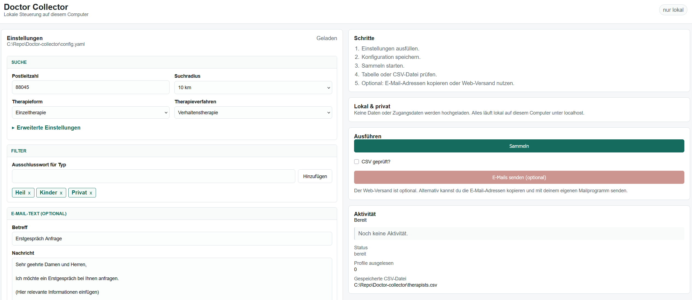

# Doctor Collector

Automatically find therapists on [therapie.de](https://www.therapie.de) and send them a request for an initial consultation (Erstgespräch) via email.

## Quick Start

### 1. Install Python

Download and install Python 3.11 or newer from the official website:

**[Download Python](https://www.python.org/downloads/)**

During installation on Windows, make sure to check **"Add Python to PATH"**.

### 2. Download this project

[Download as ZIP](https://github.com/kequach/Doctor-collector/archive/refs/heads/main.zip) and extract it, or use Git:

```
git clone https://github.com/kequach/Doctor-collector.git
```

### 3. Install dependencies

Open a terminal in the project folder and run:

```
pip install -e .
```

### 4. Configure

Either use the web UI in the next step, or open `config.yaml` in any text
editor and fill in:

- **Your postal code** and desired search radius
- **Your email credentials** (only needed if you want to send emails — see [Contact settings](#contact-settings) below)

### 5. Run with the web UI

Start the local web UI:

```
python -m doctor_collector --web
```

Then open [http://127.0.0.1:8000/](http://127.0.0.1:8000/) in your browser.
From there you can edit the `config.yaml` settings with form fields, collect
therapists, review the table, and send emails to the collected addresses after
confirming the CSV review.

### Or run from the terminal

```
python -m doctor_collector --collect
```

This searches therapie.de, filters the results, and saves everything to
`therapists.csv`. You can open this file in Excel.

## Usage

| Command | What it does |
|---------|-------------|
| `python -m doctor_collector --web` | Open the localhost web UI |
| `python -m doctor_collector --collect` | Find therapists and save to `therapists.csv` |
| `python -m doctor_collector --contact` | Send emails to reviewed therapists in `therapists.csv` |

A typical terminal workflow:

1. Run with `--collect` first to review the results in `therapists.csv`
2. Once you're happy with the list, run with `--contact` to send emails
3. The tool remembers who you already contacted — running again only emails new therapists

The combined `--collect --contact` shortcut is intentionally blocked so you
always have a chance to review the CSV before emails go out.

## Web UI

The web UI runs only on your computer and intentionally binds only to localhost
or another loopback address. Start it with:

```
python -m doctor_collector --web
```

Open [http://127.0.0.1:8000/](http://127.0.0.1:8000/). The German page shows
form fields for search settings, filter keywords, email text, and SMTP settings.
It validates changes before saving them to `config.yaml`, displays the current
CSV file path and rows, and has a button to copy all collected email addresses
comma-separated. During collection, it shows live activity updates and a
running progress indicator, including how many profiles have been read so far.
You can stop an in-progress collection from the page; rate-limit and request
delay waits wake up promptly, the current request batch finishes cleanly, and
an incomplete crawl leaves the existing CSV unchanged.
Start page, maximum pages, and request delay are available under
`Erweiterte Einstellungen`.
If Firefox opens the page through `localhost`, the page redirects itself to
`127.0.0.1` so API calls stay on the same origin.

No collected data or email credentials are uploaded by the web UI. Everything
runs locally on your computer.

Sending emails from the web UI is optional. The `E-Mails senden` button stays
disabled until you check `CSV geprüft`, keeping the same safe workflow as the
terminal commands: collect first, review the CSV/table, then contact. You can
also copy the email addresses and send from your own mail program instead.

The web UI uses the values saved in `config.yaml`. Direct environment variable
overrides are mainly for terminal and Docker runs. String `${ENV_VAR}`
placeholders, such as SMTP user or sender address placeholders, still work and
are preserved when the web UI saves the file; numeric, boolean, and list
placeholders may be saved back as their resolved values.

To use a different config file or port:

```
python -m doctor_collector --web --config path/to/config.yaml --port 8080
```

## Configuration

All settings are in `config.yaml`. Open it in any text editor.

### Search settings

```yaml
therapie:
  post_code: "10115"         # your postal code
  search_radius_km: 25       # search radius: 10, 25, 50, or 100 km
  therapy_form: 1            # 1 = Einzeltherapie, 2 = Gruppentherapie, 3 = Paar-/Familientherapie
  therapy_type: 2            # 1 = Analytische, 2 = Verhaltenstherapie, 3 = Tiefenpsychologisch, 4 = Systemische
  max_pages: 100             # how many pages of results to go through
  request_delay_seconds: 1.0 # at least 0.1 seconds between request starts
```

`search_radius_km` maps to therapie.de's `search_radius` URL parameter. The site currently accepts `10`, `25`, `50`, and `100` km. Unsupported values are rejected by Doctor Collector because therapie.de silently falls back to `10` km instead of returning an error.

If therapie.de returns `HTTP 429 Too Many Requests`, Doctor Collector waits and retries automatically. If it keeps happening, wait a few minutes before running again or increase `therapie.request_delay_seconds` in `config.yaml`. The default is `1.0`, meaning requests are started at least one second apart. The minimum accepted value is `0.1`.

### Filters

```yaml
filters:
  exclude_types:
    - "Heil"       # excludes Heilpraktiker
    - "Kinder"     # excludes child/youth therapists
    - "Privat"     # excludes private-only therapists
```

Add or remove keywords to control which therapists are excluded. Only therapists with an email address are included.

### Contact settings

Only needed when running with `--contact`. If you use Gmail, you need an **App Password** instead of your regular password:

1. Go to [myaccount.google.com](https://myaccount.google.com/) > **Security** > enable **2-Step Verification**
2. Go to [App Passwords](https://myaccount.google.com/apppasswords), create one for "Mail"
3. Copy the 16-character password into `config.yaml`:

```yaml
contact:
  subject: "Erstgespräch Anfrage"
  body: |
    Sehr geehrte Damen und Herren,

    Ich möchte ein Erstgespräch bei Ihnen anfragen.
    ...

  smtp_host: "smtp.gmail.com"
  smtp_port: 465
  use_tls: true
  smtp_user: "you@gmail.com"
  smtp_password: "your-16-char-app-password"
  from_address: "you@gmail.com"
```

<details>
<summary>Using Outlook or Yahoo instead of Gmail?</summary>

| Provider | smtp_host | smtp_port |
|----------|-----------|-----------|
| Outlook / Microsoft 365 | smtp.office365.com | 587 |
| Yahoo | smtp.mail.yahoo.com | 587 |

Both also require app passwords. See your provider's help pages for details.

</details>

## Docker

All examples below mount a `./data` folder so that output files are saved on your machine. Fill in your values where indicated.

**Step 1 — Collect therapists:**

```
docker run --rm -v ./data:/app/data \
  -e CSV_FILE=/app/data/therapists.csv \
  -e THERAPIE_POST_CODE=10115 \
  -e THERAPIE_SEARCH_RADIUS_KM=25 \
  kequach/doctor-collector python -m doctor_collector --collect
```

`THERAPIE_SEARCH_RADIUS_KM` accepts the same values as `search_radius_km`: `10`, `25`, `50`, or `100`.

**Step 2 — Review the results:**

The collected data is saved to `./data/therapists.csv`. Open it in Excel, Google Sheets, or any text editor to review before contacting.

**Step 3 — Contact therapists:**

```
docker run --rm -v ./data:/app/data \
  -e CSV_FILE=/app/data/therapists.csv \
  -e STATE_FILE=/app/data/.contacted_therapists.json \
  -e CONTACT_SMTP_USER=you@gmail.com \
  -e CONTACT_SMTP_PASSWORD=your-16-char-app-password \
  -e CONTACT_FROM_ADDRESS=you@gmail.com \
  kequach/doctor-collector python -m doctor_collector --contact
```

Do not combine collect and contact in one Docker command. Keep the same safe
sequence: collect, review `therapists.csv`, then contact.

## Development

Install development dependencies with:

```
pip install -e ".[dev]"
```

Before finishing code changes, run:

```
python -m ruff check src/ tests/
python -m pytest tests/ --tb=short
```

Codex workflow docs live in `docs/CODEX_WORKFLOW.md`, with copy/paste feature
request prompts in `docs/CODEX_FEATURE_REQUEST_TEMPLATE.md`.

## License

MIT
